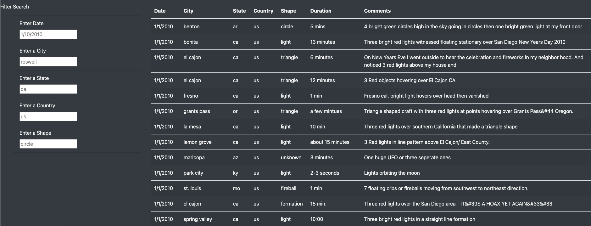
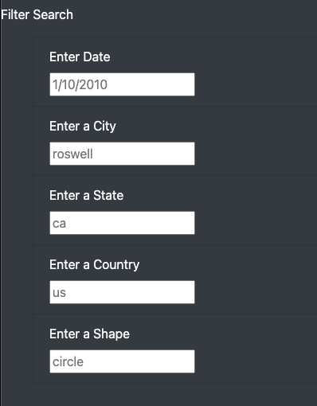
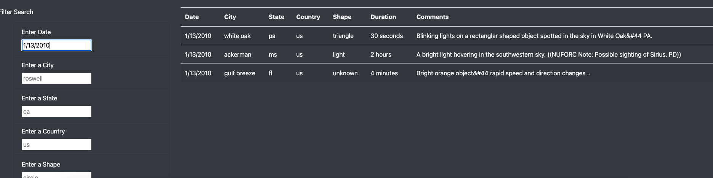

# UFOs

## Overview of the analysis:
In this project, we were helping Dana to build up a webpage to displays the information about UFO sightlings by using JavaScripts instead of Python.
And also we create a HTML index file and CSS style file apply to the UFO webpage.
We used list of information (date, city, country, state, shape, duration and comments) to filter the data from UFO sightlings.
Therefore, we create a filter search function in webpage to allow user to select one of the element to retrieved on the sightlings data.

## Results:
- In HTML index file, we adjust the format and style of the paragraph as the picture below.
The top of the website:

- Scroll down to the bottom of website can review all the data and searching function:
   

- User can use the Filter Search function that the right side of bottom:
   

- When user enter the information in the filter search function, our JavaScript file will do the filter selected and loop through all the data that user input in filter and return the filter dataset that we have in data.js back to the webpage.
This is the example for filter by date:
   

## Summary:
The filter function is provid an easier way for user to find data by relate with different filters.
- The Drawbck of this webpage is the dataset are from 2010 need to add lastest data into the website.

### Recomendation
- Those data have limitation on the area. Because the webpage is face to the users who from different countries arountthe world to acces this website.
The webpage support need to have more information from UFO sightlings for users to read or see.
- Create a comments function for user to share their experiences and picture of any kinds of UFO sightlings in the webpage.